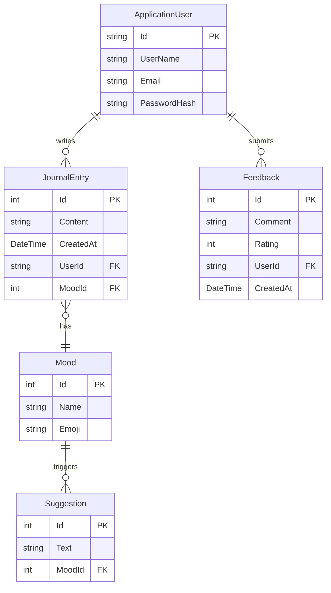
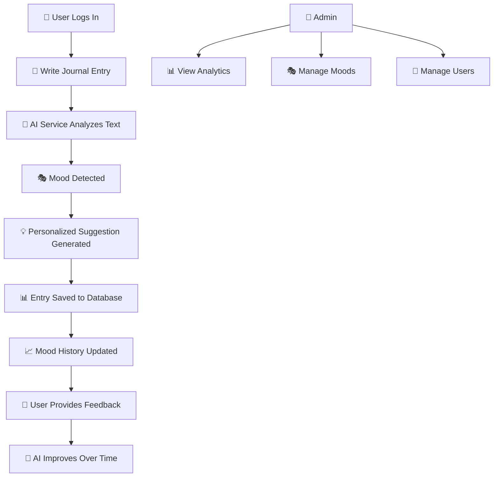

<div align="center">

# 🧠 MindfulJournal

### _Emotion-Based Journal System — Write, Reflect, Heal._

[](https://dotnet.microsoft.com/)
[](https://dotnet.microsoft.com/apps/aspnet/web-apps/blazor)
[](https://www.microsoft.com/sql-server)
[](https://docs.microsoft.com/ef/core/)
[](https://docs.microsoft.com/aspnet/core/security/authentication/identity)

<br/>

```
    ╔══════════════════════════════════════════════════════╗
    ║                                                      ║
    ║   😊  😢  😡  😰  😌  🥰  😔  🤔  😴  🎉           ║
    ║                                                      ║
    ║        ╔═╗╔═╗  ╦╔╗╔╔╦╗╔═╗╦ ╦╦                      ║
    ║        ║║║║║║  ║║║║ ║║╠╣ ║ ║║                      ║
    ║        ╩ ╩╚═╝  ╩╝╚╝═╩╝╚  ╚═╝╩═╝                    ║
    ║         ╦╔═╗╦ ╦╦═╗╔╗╔╔═╗╦                           ║
    ║         ║║ ║║ ║╠╦╝║║║╠═╣║                           ║
    ║        ╚╝╚═╝╚═╝╩╚═╝╚╝╩ ╩╩═╝                        ║
    ║                                                      ║
    ║      📝 Your emotions deserve to be understood       ║
    ╚══════════════════════════════════════════════════════╝
```

<br/>

> 📓 An **AI-powered emotional journaling web application** built with Blazor Server and SQL Server. Write daily journal entries, track your **mood patterns**, receive **AI-generated suggestions**, and gain insights into your emotional well-being — all secured with ASP.NET Identity authentication.

---

[Features](#-features) •
[Architecture](#-system-architecture) •
[Tech Stack](#-tech-stack) •
[Data Model](#-data-model) •
[Setup](#-quick-start) •
[Project Structure](#-project-structure)

</div>

---

## ✨ Features

<table>
<tr>
<td width="50%">

### 📝 Smart Journaling
- **Write daily journal entries** with rich text
- **Automatic mood detection** from journal content
- **Timestamped entries** linked to your profile
- Browse & search your **journal history**

### 🎭 Mood Tracking
- Track emotions across entries: 😊 😢 😡 😰 😌
- **Mood categories** stored in database
- Visualize your **emotional patterns** over time
- Identify triggers and trends

### 🤖 AI-Powered Insights
- **AI Service** analyzes your journal text
- Personalized **wellness suggestions** per mood
- Context-aware recommendations
- Feedback loop to improve suggestions

</td>
<td width="50%">

### 🔐 Secure Authentication
- **ASP.NET Identity** with role-based access
- **Admin** and **User** roles
- Secure password policies (min 6 chars, digit required)
- Login/Register with Razor Pages handlers

### 👑 Admin Dashboard
- **Admin Service** for platform management
- View all users and their activity
- Manage mood categories and suggestions
- Monitor system-wide emotional analytics

### 💬 Feedback System
- Users can provide **feedback** on suggestions
- Rate AI recommendations for quality
- Continuous improvement loop
- Community-driven wellness insights

</td>
</tr>
</table>

---

## 🏗️ System Architecture

```
┌──────────────────────────────────────────────────────────────────┐
│                    MindfulJournal System                          │
├──────────────────────────────────────────────────────────────────┤
│                                                                  │
│  ┌──────────────────────────────────────────────────────────┐   │
│  │                    🎨 Presentation Layer                   │   │
│  │                    (Blazor Server + Razor)                 │   │
│  │                                                           │   │
│  │  ┌─────────────┐  ┌──────────────┐  ┌────────────────┐  │   │
│  │  │ App.razor    │  │ Routes.razor  │  │ _Imports.razor │  │   │
│  │  └─────────────┘  └──────────────┘  └────────────────┘  │   │
│  │  ┌─────────────┐  ┌──────────────┐  ┌────────────────┐  │   │
│  │  │  Components/ │  │   Layout/    │  │    Pages/      │  │   │
│  │  │  Pages/      │  │  MainLayout  │  │  LoginHandler  │  │   │
│  │  └─────────────┘  └──────────────┘  └────────────────┘  │   │
│  └──────────────────────────────────────────────────────────┘   │
│                              │                                   │
│  ┌──────────────────────────────────────────────────────────┐   │
│  │                    ⚙️ Service Layer                        │   │
│  │                                                           │   │
│  │  ┌──────────────┐ ┌───────────────┐ ┌────────────────┐  │   │
│  │  │ 🤖 AIService  │ │📝 JournalSvc  │ │ 👑 AdminService│  │   │
│  │  │              │ │               │ │                │  │   │
│  │  │ • Analyze    │ │ • CreateEntry │ │ • ManageUsers  │  │   │
│  │  │   mood       │ │ • GetHistory  │ │ • ViewStats    │  │   │
│  │  │ • Generate   │ │ • TrackMood   │ │ • ManageMoods  │  │   │
│  │  │   suggestion │ │ • GetFeedback │ │ • Analytics    │  │   │
│  │  └──────────────┘ └───────────────┘ └────────────────┘  │   │
│  └──────────────────────────────────────────────────────────┘   │
│                              │                                   │
│  ┌──────────────────────────────────────────────────────────┐   │
│  │                    💾 Data Layer                           │   │
│  │                                                           │   │
│  │  ┌──────────────────────────────────────────────────┐    │   │
│  │  │         ApplicationDbContext (EF Core)            │    │   │
│  │  │                                                    │    │   │
│  │  │  DbSet<JournalEntry>    DbSet<Mood>               │    │   │
│  │  │  DbSet<Suggestion>      DbSet<Feedback>           │    │   │
│  │  │  DbSet<ApplicationUser>                            │    │   │
│  │  └──────────────────────┬───────────────────────────┘    │   │
│  │                         │                                 │   │
│  │  ┌──────────────────────▼───────────────────────────┐    │   │
│  │  │           🗄️ SQL Server (LocalDB)                 │    │   │
│  │  │           MindfulJournalDB                         │    │   │
│  │  └──────────────────────────────────────────────────┘    │   │
│  └──────────────────────────────────────────────────────────┘   │
│                                                                  │
│  ┌──────────────────────────────────────────────────────────┐   │
│  │                    🔐 Security Layer                       │   │
│  │         ASP.NET Identity + IdentityRole + Cookies          │   │
│  └──────────────────────────────────────────────────────────┘   │
│                                                                  │
└──────────────────────────────────────────────────────────────────┘
```

---

## 🗃️ Data Model



---

## 🛠️ Tech Stack

<div align="center">

| Layer | Technology | Purpose |
|:---|:---|:---|
| 🎨 **Frontend** | Blazor Server (Interactive SSR) | Real-time UI with C# — no JavaScript needed |
| ⚙️ **Backend** | ASP.NET Core (.NET 10) | Web framework, middleware pipeline, DI container |
| 🔐 **Auth** | ASP.NET Identity | User registration, login, role-based authorization |
| 💾 **ORM** | Entity Framework Core | Code-first migrations, LINQ queries, change tracking |
| 🗄️ **Database** | SQL Server (LocalDB) | Relational data storage via SSMS |
| 🤖 **AI** | Custom AI Service | Mood analysis and wellness suggestion generation |
| 📄 **Pages** | Razor Pages | Login/logout handlers with server-side processing |
| 🎨 **Styling** | CSS (wwwroot) | Custom styling and responsive design |

</div>

---

## 🚀 Quick Start

### Prerequisites

| Requirement | Why |
|:---|:---|
| **Visual Studio 2022/2025** | IDE with Blazor & .NET 10 support |
| **.NET 10 SDK** | Runtime & build tools |
| **SQL Server LocalDB** | Database engine (included with VS) |
| **SSMS** *(optional)* | SQL Server Management Studio for DB browsing |

### Installation

**1. Clone the repository**
```bash
git clone https://github.com/hussnainahmedd/Emotion-Based-Journal-System.git
cd Emotion-Based-Journal-System
```

**2. Open in Visual Studio**
```
Double-click → MindfulJournal.slnx
```

**3. Apply database migrations**
```bash
# In Package Manager Console
Update-Database
```

**4. Run the application**
```bash
dotnet run --project MindfulJournal
```

**5. Open your browser** → **https://localhost:5001** 🎉

> [!IMPORTANT]
> The app uses **SQL Server LocalDB** by default. The connection string in `appsettings.json` points to:
> ```
> Server=(localdb)\mssqllocaldb;Database=MindfulJournalDB
> ```
> Make sure LocalDB is installed (comes with Visual Studio).

---

## 📂 Project Structure

```
Emotion-Based-Journal-System/
│
├── MindfulJournal.slnx              # 📋 Visual Studio solution file
│
└── MindfulJournal/                   # 🏗️ Main Blazor Server project
    │
    ├── Program.cs                    # ⚙️ App entry — DI registration:
    │                                 #    DbContext, Identity, Blazor, Razor
    │
    ├── MindfulJournal.csproj         # 📦 .NET 10 project config & NuGet packages
    ├── appsettings.json              # 🔧 Connection strings & logging config
    ├── appsettings.Development.json  # 🔧 Dev-specific overrides
    │
    ├── Models/                       # 📊 Entity classes (EF Core)
    │   ├── ApplicationUser.cs        #    Extended IdentityUser with custom fields
    │   ├── JournalEntry.cs           #    Journal entries (content, mood, timestamp)
    │   ├── Mood.cs                   #    Mood categories (name, emoji)
    │   ├── Suggestion.cs             #    AI wellness suggestions per mood
    │   └── Feedback.cs               #    User feedback on suggestions
    │
    ├── Data/                         # 💾 Database layer
    │   └── ApplicationDbContext.cs   #    EF Core DbContext with DbSets & seeding
    │
    ├── Services/                     # ⚙️ Business logic layer
    │   ├── AIService.cs              #    🤖 Mood analysis & suggestion engine
    │   ├── JournalService.cs         #    📝 CRUD operations for journal entries
    │   └── AdminService.cs           #    👑 Admin management & analytics
    │
    ├── Components/                   # 🎨 Blazor UI components
    │   ├── App.razor                 #    Root application component
    │   ├── Routes.razor              #    Router configuration
    │   ├── _Imports.razor            #    Global using directives
    │   ├── Layout/                   #    Shared layout components
    │   └── Pages/                    #    Blazor page components
    │
    ├── Pages/                        # 📄 Razor Pages (auth handlers)
    │   ├── LoginHandler.cshtml       #    Login page markup
    │   └── LoginHandler.cshtml.cs    #    Login server-side logic
    │
    ├── Migrations/                   # 🔄 EF Core database migrations
    ├── Properties/                   # 🔧 Launch settings
    ├── wwwroot/                      # 🌐 Static files (CSS, JS, images)
    ├── bin/                          # 📦 Build output
    └── obj/                          # 📦 Build intermediaries
```

---

## 🔄 How It Works



---

## 🎭 Supported Moods

| Emoji | Mood | Description |
|:---:|:---|:---|
| 😊 | **Happy** | Positive, joyful, content |
| 😢 | **Sad** | Down, melancholic, tearful |
| 😡 | **Angry** | Frustrated, irritated, upset |
| 😰 | **Anxious** | Worried, nervous, stressed |
| 😌 | **Calm** | Peaceful, relaxed, serene |
| 🥰 | **Grateful** | Thankful, appreciative |
| 😔 | **Lonely** | Isolated, disconnected |
| 🤔 | **Confused** | Uncertain, indecisive |

---

## 🔑 Key Design Patterns

| Pattern | Where | Why |
|:---|:---|:---|
| **Dependency Injection** | `Program.cs` | All services registered via `builder.Services` |
| **Repository Pattern** | `ApplicationDbContext` | EF Core abstracts database access |
| **Service Layer** | `Services/` folder | Business logic separated from UI |
| **MVC / Component** | Blazor + Razor Pages | Clean separation of concerns |
| **Code-First Migrations** | `Migrations/` | Database schema versioned in code |
| **Identity Framework** | ASP.NET Identity | Authentication & authorization abstracted |

---

## 🤝 Contributing

1. **Fork** the repository
2. **Create** a feature branch (`git checkout -b feature/amazing-feature`)
3. **Commit** your changes (`git commit -m '✨ Add amazing feature'`)
4. **Push** to the branch (`git push origin feature/amazing-feature`)
5. **Open** a Pull Request

---

## 📜 License

This project is open source and available for educational purposes.

---

<div align="center">

**⭐ Star this repo if MindfulJournal resonated with you!**

<br/>

_"Your emotions are valid. Your journal is your safe space."_ 💜

<br/>

Built with 💜 Blazor · 🗄️ SQL Server · 🔐 ASP.NET Identity · 🤖 AI

</div>
